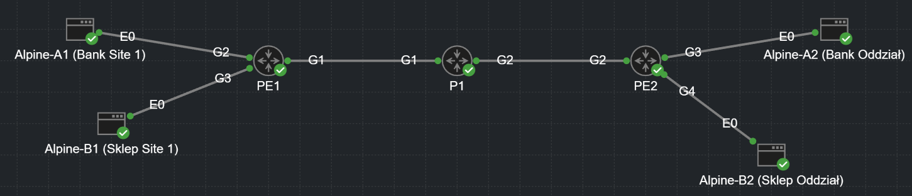

# 🌐 ISP Backbone Simulation: MPLS L3VPN with MP-BGP


## 📌 Executive Summary
This project simulates a **Service Provider (ISP) Core Network** designed to support Multi-Tenancy.  
The architecture utilizes **MPLS Layer 3 VPNs** to transport overlapping customer IP address spaces across a shared backbone infrastructure.

The goal was to replicate a real-world ISP environment where Customer A (e.g., a Bank) and Customer B (e.g., a Retailer) can communicate securely between their branch offices **despite using identical private IP addressing** (`192.168.1.0/24`).



---

## 🛠️ Technical Architecture

### 1. The Underlay (Transport)
- **OSPF Area 0:** Provides connectivity between Loopback interfaces of Provider (P) and Provider Edge (PE) routers.
- **LDP (Label Distribution Protocol):** Enabled on core interfaces to establish Label Switched Paths (LSPs).
- The core router (**P1**) performs **label swapping only**, without inspecting the IP header.

---

### 2. The Overlay (Service)
- **VRF-Lite (Virtual Routing and Forwarding):** Separate routing instances (`CUST_A` and `CUST_B`) on PE routers to isolate customer traffic.
- **MP-BGP (Multiprotocol BGP):** iBGP session between `PE1` and `PE2` using the **VPNv4** address family, enabling transport of customer routes with:
  - **Route Distinguishers (RD):** Ensure unique identification of overlapping prefixes.
  - **Route Targets (RT):** Define import/export policies between VRFs.
  - **VPN Labels:** Indicate destination VRF on the egress PE router.

---

### 3. Traffic Flow (Control & Data Plane)
- **Control Plane:**  
  PE routers exchange customer routes over MP-BGP.  
  PE1 attaches:
  - A **Transport Label** (outer MPLS label)
  - A **VPN Label** (inner MPLS label)
- **Data Plane:**  
  Core router **P1** swaps **only the Transport Label** and never learns customer routes → high scalability.

---

## 🧪 Verification & Proof of Concept

### A. End-to-End Connectivity (Multi-Tenancy)
Successful connectivity achieved for two separate customers using overlapping IP addressing.

| Client | Source IP | Destination IP | VRF | Result |
|--------|-----------|----------------|------|--------|
| **Bank (A)** | `192.168.1.100` | `192.168.2.100` | `CUST_A` | ✅ Ping Success |
| **Retail (B)** | `192.168.1.100` | `192.168.2.100` | `CUST_B` | ✅ Ping Success |

---

### B. MPLS Label Switching Analysis

**Traceroute from PE1:**
```
PE1# traceroute vrf CUST_A 192.168.2.1
Type escape sequence to abort.
Tracing the route to 192.168.2.1
VRF info: (vrf in name/id, vrf out name/id)
1 10.0.0.2 [MPLS: Labels 17/20 Exp 0] 2 msec 2 msec 3 msec
2 192.168.2.1 3 msec * 2 msec
```

**Analysis**<br>
  Label 17 (Outer): Transport Label used by P1 to reach the egress router PE2.  
  Label 20 (Inner): VPN Label used by PE2 to identify VRF CUST_A.

**📂 Repository Structure**<br>
  /configs - Final running-configurations for PE1, P1, and PE2 (Cisco IOS-XE).  
  /images - Topology diagrams and verification screenshots.

  **Project simulated using Cisco Modeling Labs (CML).**
